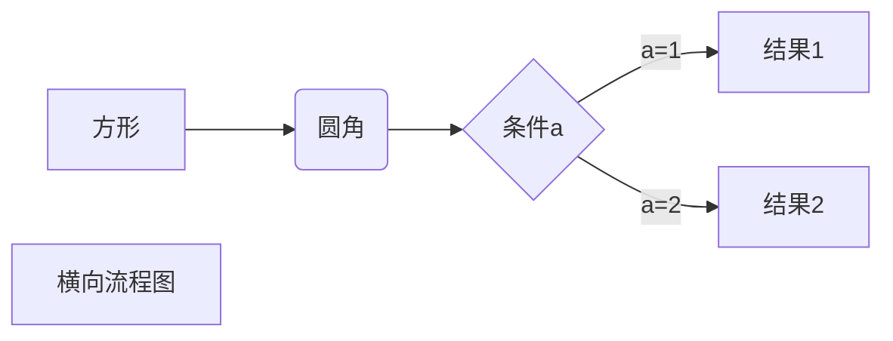
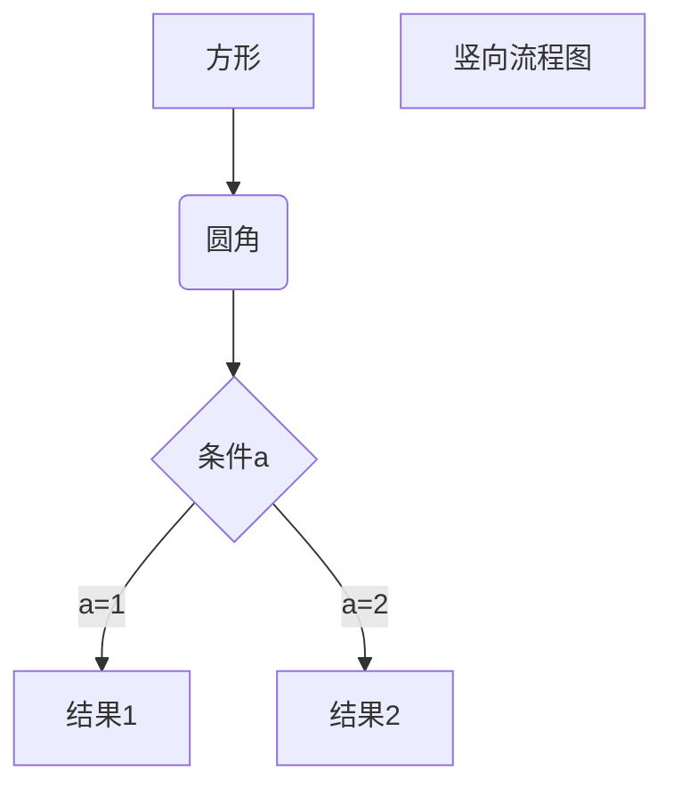
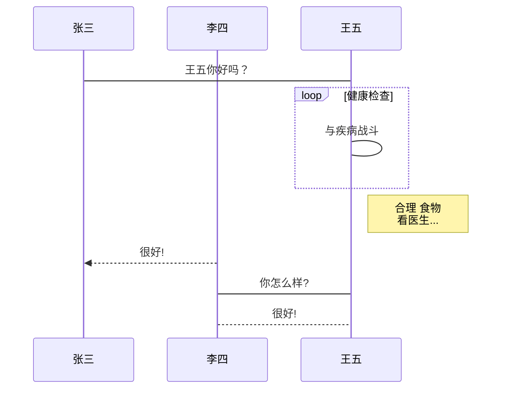
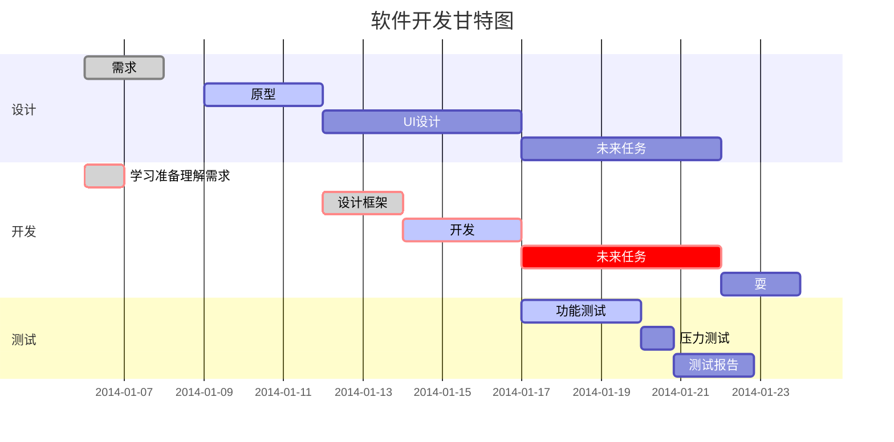

<!-- Source: https://www.runoob.com/markdown/md-tutorial.html -->


# Heading 1 symbol(#)

## Heading 2 symbol(##)

### Heading 3 symbol(###)

#### Heading 4 symbol(####)

##### Heading 5 symbol(#####)

###### Heading 6 symbol(######)

*****

~~test~~ symbol(~~text ~~)

<u>underline</u> symbol < u > text < / u >

test text [^comment]  		comment symbol [ ^ text comment ]		next line: [text comment] : output text. 

[^comment]: test comment

* li1 symbol(*)
* li2 symbol(+)
* li3 symbol(-)

1. li1 symbol(1.)

   - inner li symbol(-)

   * inner li

2. li2 symbol(2.)
   * inner li
   * inner li


> outer area
>
> > nested first area
> >
> > > nested second area  

```javascript
$(document).ready(function() {
    alert("Hello World!");
});
```

```java
package test.com.testmarkdown;

import java.io.*;

public class HelloWorld {
    public static void main(String[] args) {
        System.out.println("Hello World!");
    }
}
```


Markdown Hyperlink

[link title](https://www.testlink.com)

format [ link title ] ( hyperlink here )

<https://www.testlink.com>

format < hyperlink here > 


Markdown Image 

format 


Markdown List


| THead1 | THead2 |
| ------ | ------ |
| TRow1 | TRow2 |

使用 <kbd>Ctrl</kbd>+<kbd>Alt</kbd>+<kbd>Del</kbd> 重启电脑


以下几个实例效果图如下：

1、横向流程图源码格式：


2、竖向流程图源码格式：


3、标准流程图源码格式：

```flow
st=>start: 开始框
op=>operation: 处理框
cond=>condition: 判断框(是或否?)
sub1=>subroutine: 子流程
io=>inputoutput: 输入输出框
e=>end: 结束框
st->op->cond
cond(yes)->io->e
cond(no)->sub1(right)->op
```
4、标准流程图源码格式（横向）：

```flow
st=>start: 开始框
op=>operation: 处理框
cond=>condition: 判断框(是或否?)
sub1=>subroutine: 子流程
io=>inputoutput: 输入输出框
e=>end: 结束框
st(right)->op(right)->cond
cond(yes)->io(bottom)->e
cond(no)->sub1(right)->op
```
5、UML时序图源码样例：

```sequence
对象A->对象B: 对象B你好吗?（请求）
Note right of 对象B: 对象B的描述
Note left of 对象A: 对象A的描述(提示)
对象B-->对象A: 我很好(响应)
对象A->对象B: 你真的好吗？
```
6、UML时序图源码复杂样例：

```sequence
Title: 标题：复杂使用
对象A->对象B: 对象B你好吗?（请求）
Note right of 对象B: 对象B的描述
Note left of 对象A: 对象A的描述(提示)
对象B-->对象A: 我很好(响应)
对象B->小三: 你好吗
小三-->>对象A: 对象B找我了
对象A->对象B: 你真的好吗？
Note over 小三,对象B: 我们是朋友
participant C
Note right of C: 没人陪我玩
```
7、UML标准时序图样例：


8、甘特图样例：




